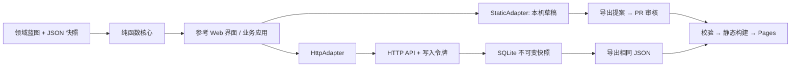

# 架构与数据契约

本文描述轻量 Graph v1 核心、模板和共享令牌服务器。另有可选受治理 runtime，提供版本化证据、具名身份、审核和私有生命周期，见 [runtime 架构与接入](runtime.md)。两个模式的身份、导出和公开读取保证不同，不应混用服务器入口。



## Graph v1

`schemaVersion` 固定为 `1`，`id` 是稳定社区标识，`title` 是显示名，`revision` 为非负安全整数。`ontology`、`nodes` 和 `edges` 必需。原始协议详见 `packages/core/index.js` 和两个完整示例；JSON 是规范数据源，HTML 仅作显示。

节点的字段：

| 字段 | 契约 |
| --- | --- |
| `id` | 1–120 字符 ASCII 稳定标识，允许字母、数字、点、冒号、连字符、下划线，首字母或数字 |
| `type` | 已声明的 `ontology.nodeTypes[].id` |
| `title` | 1–160 字符的非空文本 |
| `body` | 0–20000 字符文本，以纯文本安全显示 |
| `source` | 空字符串或 HTTP(S) URL，不允许 URL 内用户名密码 |
| `author` | 1–80 字符的署名；这是陈述性来源信息，不是已验证身份 |
| `tags` | 最多 12 个非空文本标签，每个最多 40 字符 |
| `updatedAt` | 有效 UTC ISO 日期，例如 `2026-09-09T08:00:00.000Z` |

每种节点类型声明 `id`、`label`，可设置 `required: ["body", "source"]` 的子集。所有节点都需要有效标题和作者；“required”补充领域差异。

关系包含 `id`、`from`、`to`、`type`、`reason`。两端必须存在、不得自关联、不能重复相同的 `(from,type,to)`；`reason` 是 1–500 字符。每种关系类型声明允许的起点类型 `from[]` 与终点类型 `to[]`。所有关系有方向，邻域探索可沿两个方向走；UI 明确显示“指向／来自”。

可选 `description` 为最多 20000 字符的字符串。额外领域属性可随 JSON 保留，核心只校验其可无损 JSON 序列化（拒绝循环、函数、Date、BigInt、非有限数字、访问器等）；领域含义由接入者自己的策略层校验。本参考表单只编辑公共字段。独立包的类型契约见 `packages/core/index.d.ts`。

## Change v1

```json
{
  "schemaVersion": 1,
  "id": "change-example",
  "graphId": "campus-demo",
  "baseRevision": 0,
  "operations": [
    { "op": "putNode", "value": { "id": "...完整节点..." } }
  ]
}
```

上述 `value` 只是结构示意，不是有效提案。可在演示中导出完整有效示例。

- 操作是 `putNode` 或 `putEdge`：稳定 ID 不存在时创建，存在时完整替换。不是 JSON Patch。
- 一份提案 1–2000 个操作，校验整个结果后才接受；可以在同一提案创建节点和指向它的关系。
- `baseRevision` 不匹配返回 `CONFLICT`；不自动重写 revision 或忽略冲突。
- 每次接受 revision 增加 1。重放旧提案被拒绝。
- 提案只修改节点和关系；更改蓝图或社区元数据需在源码审核流程中处理。
- 第一版不支持删除。撤回需要专门的状态、历史引用和公开投影设计，不能直接移除仍被关联的节点。

## 存储与并发

StaticAdapter 的公开基线从 URL 载入。localStorage 以“社区 ID + 数据 URL 路径”命名，存储相对公开基线的累计提案。刷新时重新验证并套用。新公开快照与旧草稿冲突时，旧数据保留供备份，禁用覆盖写入，用户可恢复或人工重整提案。

写入先完成持久化，再更新内存。支持 Web Locks 的浏览器在锁内检查旧值并写入；缺少 Web Locks 时只能尽力进行跨标签页旧值检查，严格同时写入仍有竞态，因此建议在一个标签页编辑。禁止 localStorage 的浏览器仍可浏览。

HttpAdapter 通过相同的 `load()` / `commit(change)` 接口访问 API。SQLite 的 `BEGIN IMMEDIATE` 事务读取最新图、校验 revision、写入新的不可变快照与提案，失败回滚。当前用完整快照取代复杂 ORM 或图数据库，适合小型社区；历史存储量随修改数增长。

## 服务端 API

| 请求 | 行为 |
| --- | --- |
| `GET /runtime-config.json` | 告诉页面使用静态或服务器适配器 |
| `GET /api/health` | 健康检查 |
| `GET /api/graph` | 当前完整图 |
| `GET /api/search?q=...&type=...` | 中文子串与多关键词检索，标题优先 |
| `GET /api/neighborhood?id=...&depth=1` | 0–5 层邻域 |
| `GET /api/analysis` | 节点、边、孤立节点数和连接最多的节点 |
| `POST /api/changes` | Bearer 令牌 + JSON 提案；最多 2 MiB |

错误返回 `{ "error": "..." }`：400 无效提案，401 令牌缺失或错误，409 版本冲突，415 请求类型错误。服务端无 CORS 开放，参考页面与 API 同源。读接口无需账号；如果图包含私密内容，必须在外层增加认证网关。

## 扩展计算

业务系统可以直接调用纯函数，也可以增加服务端路由，读取当前快照后投影到 FTS、向量索引或图引擎。索引应是可重建的派生数据，canonical JSON 不绑定某种搜索提供方。长任务应移到 worker，不能让 Node HTTP 事件循环承担无界计算。
